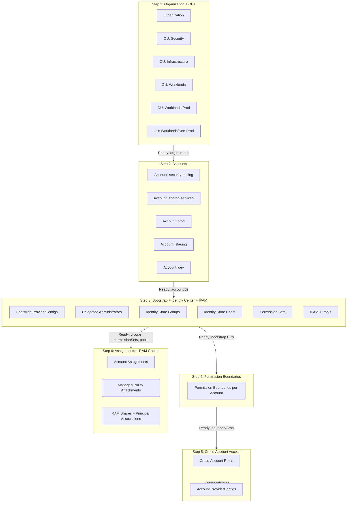
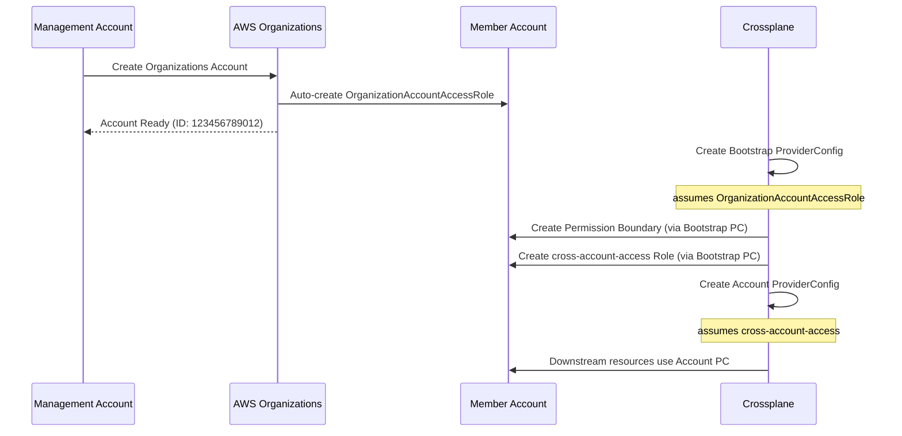

# configuration-aws-foundation

Foundation creates the entire AWS foundational layer in a single resource:

- **Organization** - AWS Organization with OUs and accounts
- **Cross-Account Access** - Bootstrap ProviderConfigs, permission boundaries, and cross-account-access roles
- **Identity Center** - AWS IAM Identity Center with groups, users, and permission sets
- **IPAM** - AWS VPC IP Address Manager with pools for centralized IP allocation

## Reconciliation Flow

The composition renders resources in stages, waiting for dependencies to become Ready before proceeding:



## Bootstrap Pattern

The key insight is how we get credentials to create resources **inside** member accounts:

1. **Management Account** creates Organizations Accounts
2. AWS automatically creates `OrganizationAccountAccessRole` in each new account
3. **Bootstrap ProviderConfig** assumes `OrganizationAccountAccessRole` to create IAM resources
4. **Permission Boundary** and **cross-account-access Role** are created in member account
5. **Final ProviderConfig** assumes `cross-account-access` role for downstream use



## Usage

```yaml
apiVersion: aws.hops.ops.com.ai/v1alpha1
kind: Foundation
metadata:
  name: acme
  namespace: acme
spec:
  managementPolicies: ["*"]

  aws:
    providerConfig: aws-management-account
    region: us-east-1

  tags:
    organization: acme

  organizationalUnits:
    - path: Security
    - path: Infrastructure
    - path: Workloads
    - path: Workloads/Prod
    - path: Workloads/Non-Prod

  accounts:
    - name: acme-security-tooling
      email: security-tooling@acme.example.com
      ou: Security

    - name: acme-shared-services
      email: shared-services@acme.example.com
      ou: Infrastructure

    - name: acme-prod
      email: prod@acme.example.com
      ou: Workloads/Prod

    - name: acme-dev
      email: dev@acme.example.com
      ou: Workloads/Non-Prod
      crossAccountAccess:
        role:
          managedPolicyArns:
            - arn:aws:iam::aws:policy/PowerUserAccess  # Override default

  delegatedAdministrators:
    - servicePrincipal: sso.amazonaws.com
      account: acme-shared-services
    - servicePrincipal: ipam.amazonaws.com
      account: acme-shared-services

  identityCenter:
    region: us-east-1
    identityStoreId: d-1234567890
    instanceArn: arn:aws:sso:::instance/ssoins-abcdef

    groups:
      - name: Administrators
        description: Full admin access

    permissionSets:
      - name: AdministratorAccess
        managedPolicies:
          - arn:aws:iam::aws:policy/AdministratorAccess
        assignToGroups:
          - Administrators
        assignToAccounts:  # Reference by name!
          - acme-shared-services
          - acme-prod

  ipam:
    delegatedAdminAccount: acme-shared-services  # Reference by name!
    homeRegion: us-east-1
    operatingRegions:
      - us-east-1
      - us-west-2
    pools:
      - name: prod-us-east-1
        cidr: 10.0.0.0/12
        allocationDefaultNetmaskLength: 20
        ramShareTargets:
          - ou: Workloads/Prod
```

## Status

```yaml
status:
  ready: true
  organization:
    ready: true
    organizationId: o-abc123
    managementAccountId: "111111111111"
    rootId: r-abc1
  organizationalUnits:
    Security: ou-abc1-security
    Infrastructure: ou-abc1-infrastructure
    Workloads: ou-abc1-workloads
    Workloads/Prod: ou-abc1-workloads-prod
    Workloads/Non-Prod: ou-abc1-workloads-non-prod
  accounts:
    - name: acme-shared-services
      id: "222222222222"
      ready: true
      crossAccountAccessRoleArn: arn:aws:iam::222222222222:role/cross-account-access
      providerConfigName: acme-shared-services
    - name: acme-prod
      id: "333333333333"
      ready: true
      crossAccountAccessRoleArn: arn:aws:iam::333333333333:role/cross-account-access
      providerConfigName: acme-prod
  identityCenter:
    ready: true
    instanceArn: arn:aws:sso:::instance/ssoins-abcdef
    identityStoreId: d-1234567890
    groups:
      - name: Administrators
        id: 12345678-abcd-...
    permissionSets:
      - name: AdministratorAccess
        arn: arn:aws:sso:::permissionSet/ssoins-.../ps-...
  ipam:
    ready: true
    id: ipam-12345678
    arn: arn:aws:ec2:us-east-1:222222222222:ipam/ipam-12345678
    region: us-east-1
    pools:
      - name: prod-us-east-1
        id: ipam-pool-abcd1234
        cidr: 10.0.0.0/12
```

## Using Account ProviderConfigs

After the Foundation is ready, downstream compositions can reference member accounts by name:

```yaml
apiVersion: ec2.aws.m.upbound.io/v1beta1
kind: VPC
metadata:
  name: prod-vpc
spec:
  providerConfigRef:
    name: acme-prod  # Uses cross-account-access role automatically
  forProvider:
    cidrBlock: 10.0.0.0/16
    region: us-east-1
```

## Dual-Stack VPCs and EKS IPv6/Auto Mode

The Foundation's IPAM supports both IPv4 and IPv6 pools for creating dual-stack VPCs
that work with EKS IPv6-mode clusters and EKS Auto Mode.

### Individual (Single-Account) Setup

For individuals and small teams, the Foundation provides a simple dual-stack IPAM
configuration perfect for EKS Auto Mode and internal microservices:

```yaml
apiVersion: aws.hops.ops.com.ai/v1alpha1
kind: Foundation
metadata:
  name: my-foundation
spec:
  managementPolicies: ["*"]

  aws:
    providerConfig: default
    region: us-east-1

  ipam:
    scope: private
    homeRegion: us-east-1
    operatingRegions:
      - us-east-1

    pools:
      # IPv4 for VPCs, control plane, nodes
      - name: ipv4
        addressFamily: ipv4
        region: us-east-1
        cidr: 10.0.0.0/8
        allocationDefaultNetmaskLength: 20

      # IPv6 public for EKS Auto Mode (Amazon-provided)
      - name: ipv6-public
        addressFamily: ipv6
        scope: public
        region: us-east-1
        locale: us-east-1
        amazonProvidedIpv6CidrBlock: true
        publicIpSource: amazon
        awsService: ec2
        allocationDefaultNetmaskLength: 56

      # IPv6 private for internal microservices (ULA)
      - name: ipv6-private
        addressFamily: ipv6
        scope: private
        region: us-east-1
        locale: us-east-1
        cidr: fd00:my:app::/48
        allocationDefaultNetmaskLength: 56
```

After the Foundation is ready, reference pool IDs when creating VPCs:

```yaml
apiVersion: ec2.aws.m.upbound.io/v1beta1
kind: VPC
spec:
  forProvider:
    region: us-east-1
    ipv4IpamPoolId: ipam-pool-xxx      # status.ipam.pools[name=ipv4].id
    ipv4NetmaskLength: 20
    ipv6IpamPoolId: ipam-pool-yyy      # status.ipam.pools[name=ipv6-public].id
    ipv6NetmaskLength: 56
    # Or use ipv6-private pool for internal-only microservices
```

### Enterprise (Multi-Account) Setup

For organizations with multiple AWS accounts, the Foundation supports complex
IPAM pool hierarchies with RAM sharing to OUs.

#### IPAM Pool Architecture

```
IPAM
├── Private Scope
│   ├── IPv4 Pools (10.x.x.x ranges)
│   │   ├── prod-ipv4-us-east-1 (10.0.0.0/12)
│   │   ├── non-prod-ipv4-us-east-1 (10.32.0.0/12)
│   │   └── shared-services-ipv4 (10.48.0.0/16)
│   └── IPv6 Private Pools (ULA - internal only)
│       └── internal-ipv6-us-east-1 (fd00:acme:0::/48)
│
└── Public Scope
    └── IPv6 Public Pools (Amazon-provided GUA)
        ├── prod-ipv6-us-east-1 (AWS allocates /52)
        ├── non-prod-ipv6-us-east-1 (AWS allocates /52)
        └── shared-services-ipv6 (AWS allocates /52)
```

### Pool Types

| Pool Type | Scope | Address Source | Use Case |
|-----------|-------|----------------|----------|
| IPv4 | Private | Explicit CIDR (e.g., 10.0.0.0/12) | VPC primary CIDR |
| IPv6 Public | Public | Amazon-provided (/52) | Internet-routable IPv6 for EKS |
| IPv6 Private | Private | ULA (fd00::/8) | Internal-only IPv6 traffic |

### Creating Dual-Stack VPCs

Reference both IPv4 and IPv6 IPAM pool IDs from the Foundation status:

```yaml
apiVersion: ec2.aws.m.upbound.io/v1beta1
kind: VPC
metadata:
  name: prod-dual-stack-vpc
spec:
  providerConfigRef:
    name: acme-prod
  forProvider:
    region: us-east-1
    # IPv4 from IPAM pool
    ipv4IpamPoolId: ipam-pool-abc123  # status.ipam.pools[name=prod-ipv4-us-east-1].id
    ipv4NetmaskLength: 20
    # IPv6 from IPAM pool (Amazon-provided)
    ipv6IpamPoolId: ipam-pool-xyz789  # status.ipam.pools[name=prod-ipv6-us-east-1].id
    ipv6NetmaskLength: 56  # AWS default for VPCs
    tags:
      Name: prod-dual-stack-vpc
```

### EKS IPv6 Cluster Requirements

For EKS clusters running in IPv6 mode (pods use IPv6 addresses):

1. **VPC**: Must have both IPv4 and IPv6 CIDRs
   - IPv4: Required for control plane, node management
   - IPv6: Used for pod networking (prefix delegation)

2. **Subnets**: Dual-stack with /64 IPv6 blocks
   ```yaml
   # Each subnet gets /64 from VPC's /56 IPv6 CIDR
   ipv6CidrBlock: "2600:1f00:xxxx:xx00::/64"  # First subnet
   ipv6CidrBlock: "2600:1f00:xxxx:xx01::/64"  # Second subnet
   ```

3. **Prefix Delegation**: EKS Auto Mode/VPC CNI uses /80 prefixes
   - Each node gets a /80 from subnet's /64
   - Supports ~65k pods per node

4. **Security Groups**: Must allow IPv6 traffic
   ```yaml
   ipv6CidrBlocks:
     - "::/0"  # All IPv6 for egress
   ```

### IPv6 Pool Sizing

| Level | Netmask | Addresses | Typical Use |
|-------|---------|-----------|-------------|
| IPAM Pool | /52 | 4,096 /64s | Regional allocation |
| VPC | /56 | 256 /64s | Per-VPC allocation |
| Subnet | /64 | 18 quintillion | Per-subnet |
| Node Prefix | /80 | ~65k addresses | Per-node (prefix delegation) |

### Status with Dual-Stack Pools

```yaml
status:
  ipam:
    ready: true
    id: ipam-12345678
    arn: arn:aws:ec2:us-east-1:222222222222:ipam/ipam-12345678
    privateScopeId: ipam-scope-private-abc123
    publicScopeId: ipam-scope-public-xyz789
    region: us-east-1
    pools:
      # IPv4 pools
      - name: prod-ipv4-us-east-1
        addressFamily: ipv4
        scope: private
        id: ipam-pool-ipv4-prod
        arn: arn:aws:ec2:us-east-1:...:ipam-pool/ipam-pool-ipv4-prod
        cidr: 10.0.0.0/12
      # IPv6 public pools (Amazon-provided)
      - name: prod-ipv6-us-east-1
        addressFamily: ipv6
        scope: public
        id: ipam-pool-ipv6-prod
        arn: arn:aws:ec2:us-east-1:...:ipam-pool/ipam-pool-ipv6-prod
        cidr: 2600:1f00:xxxx::/52  # Allocated by Amazon
      # IPv6 private pools (ULA)
      - name: internal-ipv6-us-east-1
        addressFamily: ipv6
        scope: private
        id: ipam-pool-ipv6-internal
        arn: arn:aws:ec2:us-east-1:...:ipam-pool/ipam-pool-ipv6-internal
        cidr: fd00:acme:0::/48
```

### Downstream Composition Example

A VPC composition can reference Foundation pools:

```yaml
# In your VPC composition's gotmpl:
{{ $foundation := ... }}  # Reference Foundation XR
{{ $ipv4PoolId := "" }}
{{ $ipv6PoolId := "" }}
{{ range $pool := $foundation.status.ipam.pools }}
  {{ if and (eq $pool.name "prod-ipv4-us-east-1") (eq $pool.addressFamily "ipv4") }}
    {{ $ipv4PoolId = $pool.id }}
  {{ end }}
  {{ if and (eq $pool.name "prod-ipv6-us-east-1") (eq $pool.addressFamily "ipv6") }}
    {{ $ipv6PoolId = $pool.id }}
  {{ end }}
{{ end }}

---
apiVersion: ec2.aws.m.upbound.io/v1beta1
kind: VPC
spec:
  forProvider:
    ipv4IpamPoolId: {{ $ipv4PoolId }}
    ipv4NetmaskLength: 20
    ipv6IpamPoolId: {{ $ipv6PoolId }}
    ipv6NetmaskLength: 56
```

## Development

```bash
# Render examples
make render-individual
make render-enterprise
make render-import-existing

# Render enterprise with observed resources (test multi-step reconciliation)
make render-enterprise-step-1  # Organization + OUs ready
make render-enterprise-step-2  # Accounts ready
make render-enterprise-step-3  # Bootstrap ProviderConfigs ready
make render-enterprise-step-4  # Permission Boundaries ready
make render-enterprise-step-5  # Cross-Account Roles ready
make render-enterprise-step-6  # Groups + PermissionSets + IPAM ready

# Run all enterprise steps
make render-enterprise-all-steps

# Run tests
make test

# Validate
make validate

# Build package
make build
```

## License

Apache-2.0
